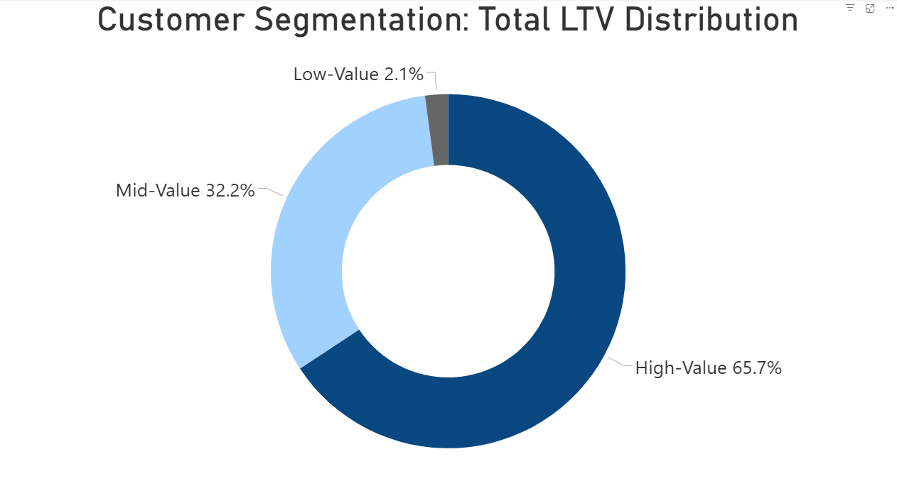
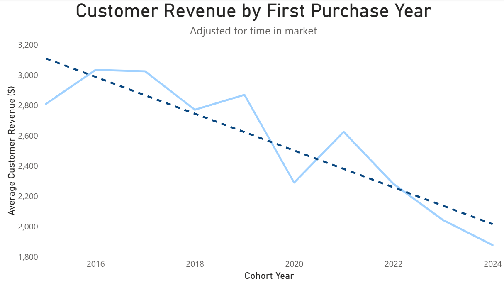
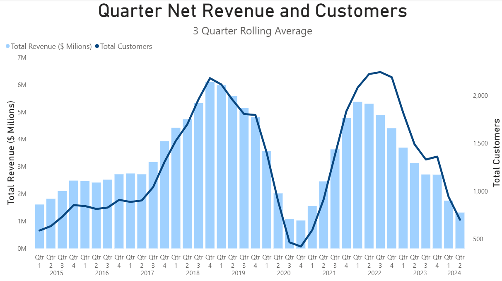

# Intermediate SQL - Sales Analysis

Welcome to my project showcasing how I use **SQL** and **Power BI** to analyze sales performance and customer behavior.

Special thanks to [Luke Barousse](https://github.com/lukebarousse) and [Kelly Adams](https://github.com/kellyjadams) for the course ["Intermediate SQL for Data Analytics"](https://www.youtube.com/watch?v=QKIGsShyEsQ), which helped me build and apply these skills in a realistic business scenario.

**Data Source**: [Contoso Data Generator V2](https://github.com/sql-bi/Contoso-Data-Generator-V2)

## Overview

Analysis of customer behavior, retention, and lifetime value for an e-commerce company to improve customer retention and maximize revenue.

## Business Questions

1. **Customer Segmentation:** Who are our most valuable customers?
2. **Cohort Analysis:** How do different customer cohorts generate revenue over time?
3. **Retention Analysis:** Which customers haven’t purchased recently and are at risk of churn?

## Clean Up Data

**Query**: [0_Cohort_Analysis.sql](0_Cohort_Analysis.sql)

- Aggregated sales and customer data into revenue metrics
- Calculated first purchase dates for cohort analysis
- Created view combining transactions and customer details

## Analysis

### 1. Customer Segmentation

**Query**: [1_Customer_Segmentation.sql](1_Customer_Segmentation.sql)

- Categorized customers based on total lifetime value (LTV)
- Assigned customers to High, Mid, and Low-value segments
- Calculated key metrics like total revenue

**Visualization:**

**Key Findings:**

- **High-value** segment (25% of customers) generates **~65.7%** of total revenue ($135.6M) 
- **Mid-value** segment (50% of customers) contributes **~32.2%** of revenue ($66.4M)
- **Low-value** segment (25% of customers) accounts for only **~2.1%** of revenue ($4.3M)

**Business Insights**

- **High-Value (≈66% revenue)** – Design a premium / VIP program for **12,372** top customers: losing even a small fraction of this group would materially hit revenue.  
- **Mid-Value (≈32% revenue)** – Use personalized campaigns to nudge them toward High-Value behavior; even a modest uplift in average LTV here translates into **tens of millions of dollars** in incremental revenue.  
- **Low-Value (≈2% revenue)** – Focus on low-cost, automated re-engagement (email, discounts, bundles).

### 2. Cohort Analysis

- Tracked revenue and customer count by cohort_year (year of first purchase)  
- Normalized comparisons by using only each customer's first purchase  
- Analyzed average first-purchase revenue per customer at the cohort level

> Note: An additional analysis of revenue share by days since first purchase shows that the very first order accounts for **~60% of total revenue**. For that reason, the cohort and quarterly trend charts below focus on **first-purchase revenue only**, while the LTV segmentation captures the full multi-order behavior.

#### Customer Revenue by Cohort Year

**Query**: [2.0_Customer_Revenue_Normalized.sql](2.0_Customer_Revenue_Normalized.sql)

**Visualization:**

**Key Findings:**

- Average first-purchase revenue per customer is structurally trending down: the trendline falls from **~$3.0K** per customer for **2016–2017** cohorts to **~$1.9K** for the **2024** cohort.
- The 2020 cohort shows a sharp drop to ~$2.3K, followed by a partial rebound in the 2021 cohort to ~$2.6K, but newer 2022–2024 cohorts slide back toward ~$2.0–2.2K, suggesting any average revenue per user (ARPU) recovery after 2020 was temporary.

#### Quarter Revenue & Customer Trends (3-Quarter Rolling Average)

**Query**: [2.1_Quarter_Revenue_Customer_Trends.sql](2.1_Quarter_Revenue_Customer_Trends.sql)

**Visualization:**

  

**Key Findings:**

- Based on the 3-quarter rolling average, both new-customer revenue and the number of new customers grow steadily from 2015–2019, with quarterly first-purchase revenue increasing from **~$2M** to **~$6M+** and the new-customer base from **~600** to **~2,200**.  
- In 2020, the business experiences a sharp downturn in new-customer acquisition: first-purchase revenue falls back toward **~$1M**, and new customers drop toward **~400**, indicating a short but severe contraction.  
- From 2021–2022, both metrics rebound strongly, reaching new highs of **~$5.3M+** in first-purchase revenue and **~2,200+** new customers, suggesting successful re-acceleration after the shock.  
- Since early 2023, new-customer revenue and acquisition have both turned downward, and by 2024 they are trending back toward 2017–2018 levels, pointing to renewed demand and retention challenges rather than a one-off seasonal fluctuation.  
- Combining both charts, growth in first-purchase revenue appears to have come mainly from adding more new customers rather than monetizing them better: recent cohorts generate **~30% less first-purchase revenue per customer** than the **2016–2017** cohorts, which amplifies the impact of the **2023–2024** decline in customer counts.

**Business Insights:**

- Boost retention & re-engagement by targeting recent cohorts (2022-2024) with personalized offers to prevent churn.  
- Stabilize revenue fluctuations and introduce loyalty programs or subscriptions to ensure consistent spending.  
- Investigate cohort differences by applying successful strategies from high-spending cohorts (2016-2018) to newer ones.

### 3. Customer Retention
Query: [3_retention_analysis.sql](3_retention_analysis.sql)

- Identified customers at risk of churning
- Analyzed last purchase patterns
- Calculated customer-specific metrics

**Visualization:**

**Key Findings:**

- Across all cohorts, **~90%** of customers are classified as **churned** (no purchase in the last 6 months), with only **~8–10%** still active in each cohort.  
- Cohort-to-cohort differences are small: retention stays low and fairly stable, which suggests that churn is a **systemic issue**, not a problem limited to specific years.  
- Newer cohorts (e.g., 2021–2023) show a similar split between Active and Churned customers, indicating that – without intervention – future cohorts are likely to end up with the **same ~90% churn** profile.

**Business Insights:**

- Strengthen **early engagement strategies** to target customers in the first 6–12 months after first purchase with onboarding incentives, loyalty rewards, and personalized offers to improve long-term retention before customers cross the 6-month no-purchase threshold.  
- Re-engage **high-value churned customers** via targeted win-back campaigns; given that ~90% of each cohort churns, focusing on the top-value segment is likely to deliver the highest return on investment (ROI).
- Predict & preempt churn risk by building models on customer behavior (drop in frequency, smaller baskets, fewer categories) and intervening **before** a customer hits 6 months of inactivity.

## Strategic Recommendations

1. **Customer Value Optimization** (Customer Segmentation)
   - Launch VIP program for 12,372 high-value customers (66% revenue)
   - Create personalized upgrade paths for mid-value segment ($66.4M → $135.6M opportunity)
   - Design price-sensitive promotions for low-value segment to increase purchase frequency

2. **Cohort Performance Strategy** (Customer Revenue by Cohort)
   - Target 2022-2024 cohorts with personalized re-engagement offers
   - Implement loyalty/subscription programs to stabilize revenue fluctuations
   - Apply successful strategies from high-spending 2016-2018 cohorts to newer customers

3. **Retention & Churn Prevention** (Customer Retention)
   - Strengthen engagement in the first 1–2 years with onboarding incentives and loyalty rewards
   - Focus on targeted win-back campaigns for high-value churned customers
   - Implement a proactive intervention system for at-risk customers before they lapse

## Technical Details
- **Database:** PostgreSQL
- **Analysis Tools:** PostgreSQL, DBeaver
- **Visualization:** Power BI